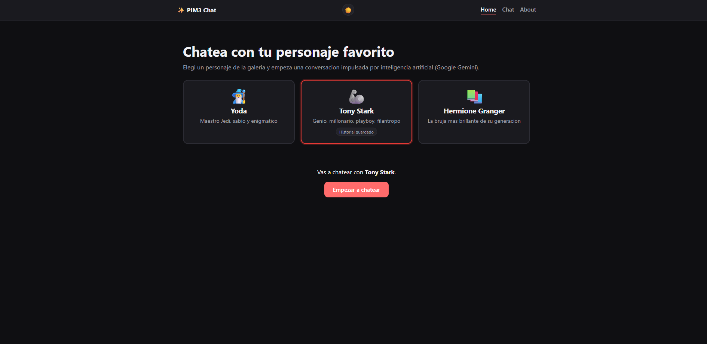
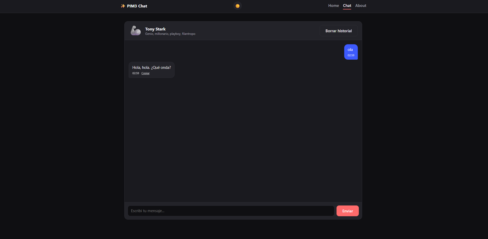
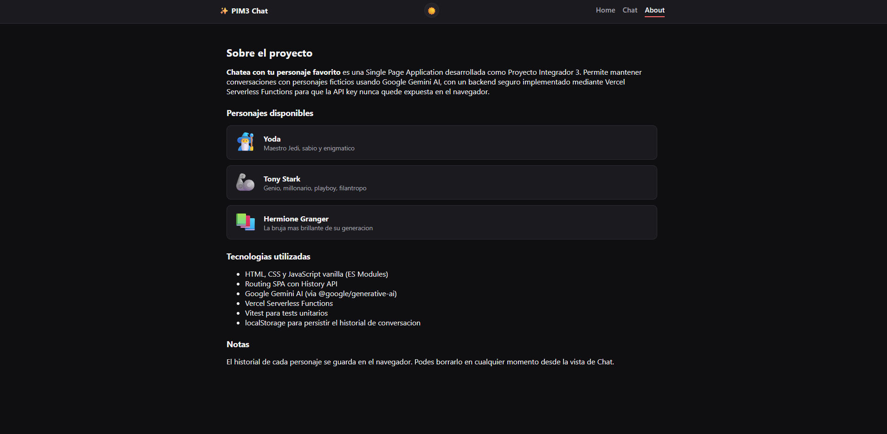
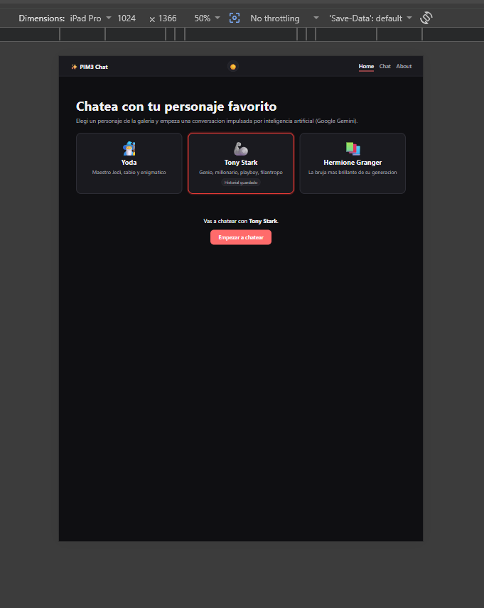
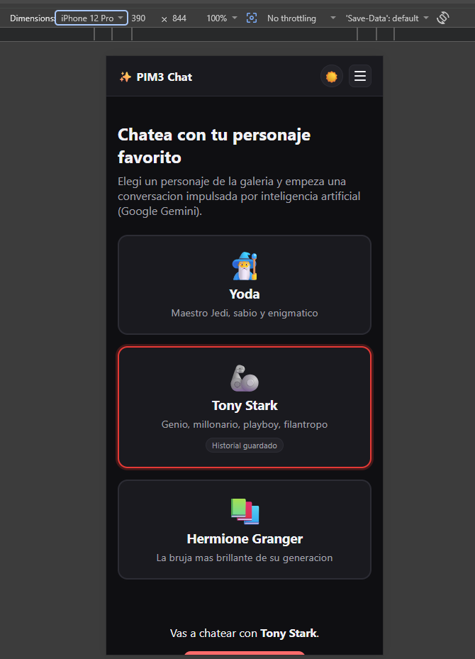
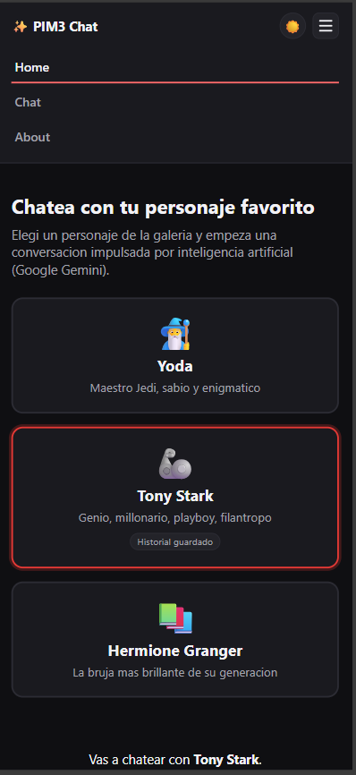

# Chatea con tu personaje favorito — Proyecto Integrador 3

Single Page Application que permite conversar con personajes ficticios usando
Google Gemini AI. El backend usa una Vercel Serverless Function como proxy,
por lo que la API key nunca se expone en el navegador.

## Personajes disponibles

| Personaje | Personalidad |
|---|---|
| 🧙‍♂️ Yoda (Star Wars) | Sabio, enigmático, habla invirtiendo el orden de las palabras |
| 🦾 Tony Stark (Iron Man) | Sarcástico, ingenioso, seguro de sí mismo |
| 📚 Hermione Granger (Harry Potter) | Inteligente, estudiosa, cita libros y hechizos |

Cada uno tiene su propio system prompt en `src/characters.js`.

## Funcionalidades

- **Routing SPA con History API**: navegación entre `/home`, `/chat` y `/about`
  sin recargar la página, con soporte completo de los botones back/forward
  (`popstate`).
- **Chat con IA**: mensajes diferenciados visualmente, indicador de
  "escribiendo...", envío con botón o `Enter`, manejo de errores de red.
- **Diseño responsive mobile-first** con breakpoints en `600px` (tablet) y
  `1024px` (desktop).
- **Persistencia con localStorage**: el historial se guarda por personaje,
  se recupera al recargar, y se puede borrar con el botón "Borrar historial".
  La galería de Home muestra qué personajes tienen historial guardado.
- **Galería de personajes**: elegí con quién chatear desde tarjetas visuales
  en Home.
- **Extras de UX**: timestamps en cada mensaje, botón para copiar respuestas
  de la IA al portapapeles, y toggle de modo oscuro/claro.

## Capturas de pantalla

| Home (desktop) | Chat (desktop) | About (desktop) |
|---|---|---|
|  |  |  |

| Home (tablet) | Home (mobile, menú cerrado) | Home (mobile, menú abierto) |
|---|---|---|
|  |  |  |

## Arquitectura del chat: payload generico + adaptador

El frontend nunca arma un request especifico de Gemini. En cambio, arma un
**payload generico** (`model`, `system`, `messages`, `max_tokens`,
`temperature`) y se lo manda tal cual a `/api/chat`. El backend es el unico
que sabe que el proveedor es Gemini y traduce ese contrato a su formato. Si
el dia de mañana se cambia de proveedor de IA, solo hay que tocar
`api/chat.js` y `api/utils/gemini.js` — el resto de la app no se entera.

```
Frontend (src/engine/)                    Backend (api/)
─────────────────────                     ──────────────
payload.js   → arma { model, system,      chat.js       → orquesta todo
                messages, max_tokens,     utils/request.js  → lee y valida
                temperature }                                el payload
history.js   → recorta el historial       utils/gemini.js   → adapta el
                antes de mandarlo                             payload a Gemini
aiClient.js  → POST a /api/chat           utils/response.js → devuelve
normalizer.js → parsea la respuesta                          siempre el mismo
                a { text, truncated }                        shape (content[])
                                          utils/errors.js    → detecta rate
                                                                limit (429)
```

## Estructura del proyecto

```
PoyectoEntregrador3/
├── api/
│   ├── chat.js                  # Serverless function: orquesta el pipeline
│   └── utils/
│       ├── request.js            # parseJsonBody, getMessages, getGenerationSettings
│       ├── gemini.js              # Adapta el payload generico al formato de Gemini
│       ├── response.js             # Shape de respuesta uniforme (content[])
│       └── errors.js                # getHttpStatus, isRateLimitError
├── src/
│   ├── main.js             # Punto de entrada
│   ├── router.js            # Routing SPA con History API
│   ├── navigation.js        # Render de la navegación + toggle de tema
│   ├── state.js              # Personaje seleccionado (estado en memoria)
│   ├── characters.js         # Definición de personajes, system prompts y temperature
│   ├── storage.js             # Helpers de localStorage (historial, tema)
│   ├── theme.js                # Modo oscuro/claro
│   ├── utils.js                  # Funciones puras (escape HTML, mensajes, etc.)
│   ├── engine/
│   │   ├── payload.js               # buildPayload, isValidPayload, createSystemPrompt
│   │   ├── history.js                # getTrimmedHistory (recorte de contexto)
│   │   ├── aiClient.js                 # callAI(payload) -> fetch a /api/chat
│   │   └── normalizer.js                # normalizeAIResponse, extractUsage
│   └── views/
│       ├── home.js         # Galería de personajes + bienvenida
│       ├── chat.js          # Interfaz de chat
│       ├── about.js          # Info del proyecto
│       └── notFound.js        # Vista 404
├── tests/                # Tests unitarios (Vitest)
├── index.html
├── styles.css
├── vercel.json           # Rewrites de SPA (mismo patron que M3L7)
├── vitest.config.js
├── package.json
├── .env.example
└── .env                  # No se sube al repo (ver .gitignore)
```

## Requisitos previos

- Node.js 18 o superior
- Una API key de [Google AI Studio](https://aistudio.google.com/) para Gemini
  (tiene tier gratuito, no hace falta tarjeta para empezar)

## Instalación

```bash
npm install
```

Copiá `.env.example` a `.env` (o completá el `.env` ya presente) y agregá tu
API key:

```
GEMINI_API_KEY=tu_api_key_de_google_ai_studio
GEMINI_MODEL=gemini-2.5-flash
```

## Correr en local

No abras `index.html` con doble clic: el routing con History API necesita
que la app se sirva por HTTP (no por `file://`).

```bash
npm run local
```

Esto corre `vercel dev` (via `npx`, sin necesidad de instalar la CLI
globalmente ni loguearte para desarrollo local). Levanta el sitio estático y
la serverless function `api/chat.js` juntos, respetando los rewrites de
`vercel.json` para que `/chat` y `/about` funcionen al recargar la página
directamente en esas rutas — el mismo flujo que usa la resolución de M3L7.

> El script se llama `local` y no `dev` a propósito: si se llama `dev`,
> Vercel CLI lo detecta como el "Development Command" del proyecto y
> `vercel dev` termina invocándose a sí mismo en un loop infinito.

Abrí `http://localhost:3000` y probá: navegación entre vistas, botones
back/forward, galería de personajes, modo oscuro/claro, persistencia en
localStorage, y el chat real con cada personaje.

## Tests

El proyecto incluye 60 tests unitarios con [Vitest](https://vitest.dev/)
sobre las funciones puras del pipeline de chat: construcción y validación del
payload, adaptación al formato de Gemini, normalización de la respuesta,
recorte de historial, manejo de personajes, routing, persistencia en
localStorage, y el cliente de red con `fetch` mockeado (sin tocar la red).

```bash
npm test
```

Archivos de test:

- `tests/payload.test.js` — `buildPayload` arma el contrato correcto;
  `isValidPayload` detecta payloads mal formados (incluye el caso de un
  `role: "system"` colado dentro de `messages[]`).
- `tests/history.test.js` — `getTrimmedHistory` recorta al límite de turnos.
- `tests/normalizer.test.js` — `normalizeAIResponse` extrae texto de forma
  segura y nunca rompe con shapes inesperados; `extractUsage` lee tokens.
- `tests/aiClient.test.js` — `callAI` con `fetch` **mockeado** (`vi.stubGlobal`),
  sin red real: verifica el POST, éxito, errores HTTP, rate limit (429) y
  respuestas no-JSON.
- `tests/api-gemini.test.js` — el adaptador mapea `assistant` → `model` y
  filtra roles inválidos antes de mandarlos a Gemini.
- `tests/api-request.test.js` — parseo del body, validación de `messages[]`,
  defaults de `getGenerationSettings`.
- `tests/api-response.test.js` — el shape de respuesta (`content[]`,
  `stop_reason`, `usage`) es consistente sin importar el proveedor.
- `tests/api-errors.test.js` — detección de rate limit (429) y status HTTP.
- `tests/utils.test.js` — escape de HTML, creación de mensajes, timestamps,
  conversión de mensajes internos al formato `{role, content}`.
- `tests/characters.test.js` — búsqueda de personajes por id, y que cada uno
  tenga `systemPrompt` y `temperature` válidos.
- `tests/router.test.js` — resolución de rutas a sus vistas correspondientes.
- `tests/storage.test.js` — guardar, leer y borrar historial en localStorage.

## Deploy en Vercel

La aplicación está desplegada en:
**https://proyecto-m3-webster-fievre.vercel.app/**

El `vercel.json` con los rewrites ya está en el repo, así que el flujo fue:
subir el repo a GitHub, importarlo en [Vercel](https://vercel.com/new),
configurar las variables de entorno `GEMINI_API_KEY` y `GEMINI_MODEL` en
**Settings → Environment Variables**, y desplegar. Vercel detecta
`api/chat.js` como Serverless Function automáticamente.

## Notas de seguridad

- La API key de Gemini solo se usa dentro de `api/chat.js`, que corre en el
  servidor de Vercel. El cliente nunca la ve.
- El texto de usuario se escapa (`escapeHTML`) antes de insertarse en el DOM
  para evitar inyección de HTML.
- Si una API key llega a exponerse por error (por ejemplo, se pega en un
  chat, un commit o un log), hay que rotarla/revocarla en el dashboard del
  proveedor y generar una nueva.

## Sobre el uso de IA en el desarrollo

Este proyecto fue construido con la asistencia de Claude (Anthropic) como
copiloto de desarrollo. Resumen del proceso:

- Se le pidió a la IA que generara la estructura base de la SPA (Parte 0 y
  Parte 1 de la guía) con routing simple antes de integrar un proveedor de IA.
- El proveedor de IA se probó primero con Gemini, se migró temporalmente a
  OpenAI (por disponibilidad de API key), y finalmente se volvió a Gemini
  para alinearse con lo enseñado en `M3L7` del curso. Se tomó como referencia
  la arquitectura de `M3L7/resolution` (payload genérico en el frontend +
  adaptador específico del proveedor en el backend), replicada en
  `src/engine/` y `api/utils/` — gracias a esa separación, cada cambio de
  proveedor terminó tocando solo `api/chat.js` y el archivo adaptador
  (`api/utils/gemini.js`), sin modificar el resto de la app.
- Decisiones tomadas a partir de las sugerencias de la IA: se eligieron los
  personajes Yoda, Tony Stark y Hermione Granger por tener voces muy
  distintivas y fáciles de reconocer en un system prompt corto; se separaron
  las funciones puras (`utils.js`, `characters.js`, `engine/`, `api/utils/`)
  del código con efectos secundarios (DOM, localStorage, fetch, llamada a la
  API) específicamente para poder testear con Vitest sin mockear casi nada.
- Todo el código generado fue revisado y ejecutado localmente (`npm test`,
  y llamadas reales a la API) antes de darlo por válido.
# ProyectoM3_WebsterFievre
